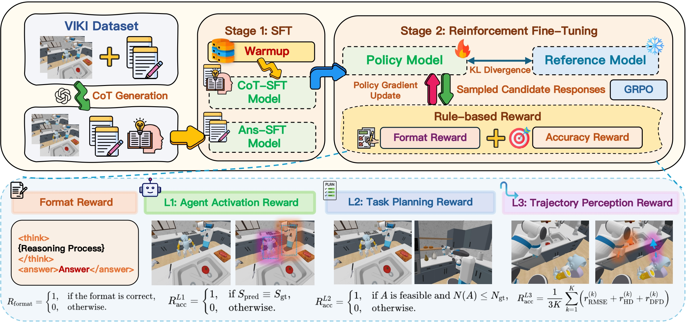

<div align="center">
  
</div>

# RoboFactory-VIKI  
**VIKI-R: Coordinating Embodied Multi-Agent Cooperation via Reinforcement Learning**

<p align="center">
  ⭐️ <a href="#overview">Overview</a> &nbsp;&nbsp;│&nbsp;&nbsp; 🤖 <a href="#model-zoo">Model Zoo</a> &nbsp;&nbsp;│&nbsp;&nbsp; 📊 <a href="#datasets">Datasets</a> &nbsp;&nbsp;│&nbsp;&nbsp; 🚀 <a href="#quick-start">Quick Start</a> &nbsp;&nbsp;│&nbsp;&nbsp; 📑 <a href="#citation">Citation</a>
</p>

## 🔥 Overview <a name="overview"></a>

**RoboFactory-VIKI** comprises **VIKI-Bench** (a hierarchical multi-agent visual reasoning benchmark) and **VIKI-R** (a two-stage learning framework).  
- **VIKI-Bench** introduces a three-level evaluation suite—**Agent Activation**, **Task Planning**, **Trajectory Perception**—with **23,737** tasks across **100** scenes, **6** robot morphologies, and over **1,000** asset combinations, offering both global and first-person views.  
- **VIKI-R** builds on **Qwen2.5-VL-Instruct** (3B/7B) via:  
  1. **Supervised Fine-Tuning (SFT)** with Chain-of-Thought annotations  
  2. **Reinforcement Fine-Tuning (GRPO)** using Grouped Relative Policy Optimization and combined format + correctness rewards  

## 🎯 Key Features

- **Hierarchical Dataset**: 23,737 tasks, 100 scenes, 6 robot types, ≥1,000 asset combos  
- **GRPO RL**: Structured planning with dual-format and correctness rewards  
- **Robotic-Focused**: home layouts, varied multi-robot tasks  
- **Metrics**: Activation accuracy, planning correctness & efficiency, trajectory RMSE/HD/DFD  

## ⭐️ Pipeline <a name="pipeline"></a>

<div align="center">
  
</div>

## 🗂️ Model Zoo <a name="model-zoo"></a>

| Model Size | Levels Supported | Training Stages   | Download           | Status      |
|------------|------------------|-------------------|--------------------|-------------|
| 3B         | L1 / L2 / L3     | SFT + GRPO        | [viki-3b](./models/) | Coming Soon |
| 7B         | L1 / L2 / L3     | SFT + GRPO        | [viki-7b](./models/) | Coming Soon |

## 📊 Datasets <a name="datasets"></a>

### VIKI-Bench Levels  
- **Level 1: Agent Activation**  
  Select the appropriate subset of agents given a scene and instruction  
- **Level 2: Task Planning**  
  Generate executable multi-agent action sequences within reference length  
- **Level 3: Trajectory Perception**  
  Predict spatial trajectories of visible agents from first-person views; evaluate via RMSE, Hausdorff, and Dynamic Fréchet Distance  

**Statistics:**  
- **23,737** task samples  
- **100** diverse 3D scenes  
- **6** heterogeneous robot morphologies (e.g., dual-arm, tracked, legged, humanoid)  
- **>1,000** asset combinations  
- Global view + multi-view first-person perspectives  

## 🚀 Quick Start <a name="quick-start"></a>

```bash
# Clone repository
git clone https://github.com/your-org/RoboFactory-VIKI.git
cd RoboFactory-VIKI

# Create Conda environment
conda env create -f roboviki.yml
conda activate roboviki

# Install verl framework
cd verl
pip install --no-deps -e .

# Install FlashAttention
# Download wheel from: https://github.com/Dao-AILab/flash-attention
pip install flash_attn-2.7.4.post1+cu12torch2.6cxx11abiFALSE-cp310-cp310-linux_x86_64.whl

# Example: 3B model SFT training
llamafactory-cli configs/viki-1-3b.yaml

# Example: GRPO RL training (3B)
cd train/3BGRPO/VIKI-L1
bash VIKI-R-zero.sh
bash VIKI-R.sh
````

## 📑 Citation <a name="citation"></a>

```bibtex
@inproceedings{robofactory-viki2025,
  title={{VIKI-R}: Coordinating Embodied Multi-Agent Cooperation via Reinforcement Learning},
  author={},
  booktitle={},
  year={2025},
  url={https://github.com/your-org/RoboFactory-VIKI}
}
```

---

Made with ❤️ for the robotics and AI community
